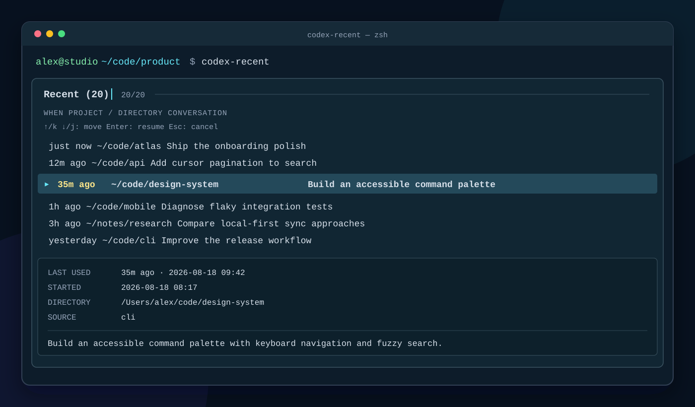

# codex-recent

**Jump back into any Codex conversation in seconds.**

`codex-recent` is a fast, keyboard-first `fzf` picker for every [Codex CLI](https://developers.openai.com/codex/cli/) conversation on your machine—across projects and working directories.



Codex remembers your sessions. `codex-recent` makes them feel instantly reachable: fuzzy-find the conversation you want, press Enter, and continue exactly where you left off in its original directory.

No cloud service, account integration, or new database. It reads Codex's existing local state in read-only mode and hands the selected session straight back to `codex resume`.

## Why you'll want it

- **One picker for every project.** Stop hunting through directories for the conversation you need.
- **Recency at a glance.** See when each session was last active, with exact timestamps in the preview.
- **Stay on the keyboard.** Search with `fzf`, move with arrows or `j` / `k`, and resume with Enter.
- **Resume in context.** Every session reopens from the working directory where it started.
- **Local and lightweight.** One Bash script, one read-only SQLite query, no background process.

## Requirements

- macOS or Linux
- Bash 3.2+
- [Codex CLI](https://developers.openai.com/codex/cli/)
- [`fzf`](https://github.com/junegunn/fzf)
- `sqlite3`

## Install

```sh
git clone https://github.com/beejmaxx/codex-recent.git
cd codex-recent
install -m 755 codex-recent ~/.local/bin/codex-recent
```

Make sure `~/.local/bin` is on your `PATH`.

## Usage

```text
codex-recent [COUNT] [--hours HOURS] [--list] [--all-sources]
```

```sh
codex-recent                 # pick from the latest 20 conversations
codex-recent 50              # pick from the latest 50
codex-recent --hours 24      # only conversations active in the last day
codex-recent --all-sources   # include subagent/non-interactive sessions
codex-recent --list          # print instead of opening fzf
```

Use arrow keys or `j` / `k` to move, Enter to resume, and Esc to cancel. Since plain `j` and `k` are navigation keys, use another part of the title or path when fuzzy-searching.

## How it works

`codex-recent` locates the newest `state_*.sqlite` database under `${CODEX_HOME:-~/.codex}`, queries its `threads` table without modifying it, and runs:

```sh
codex resume SESSION_ID
```

from the selected conversation's saved working directory.

## License

[MIT](LICENSE)
